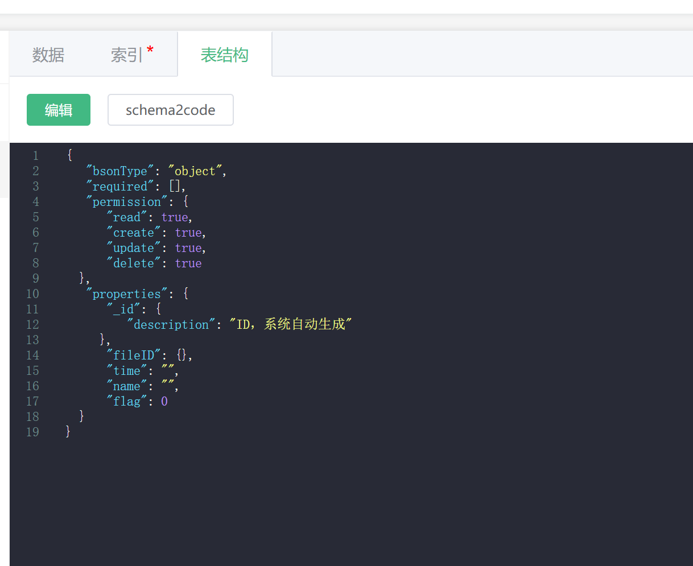
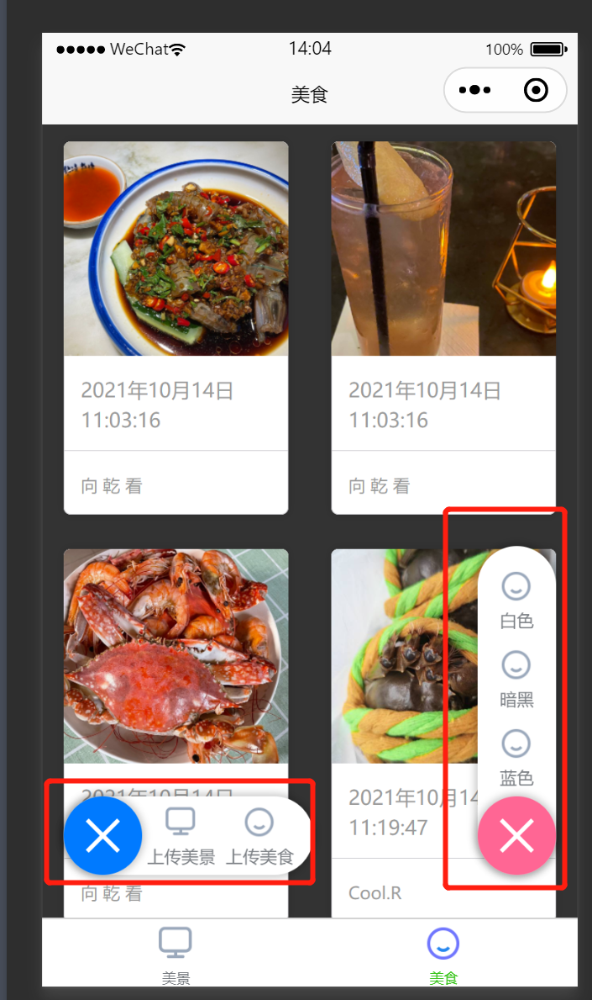
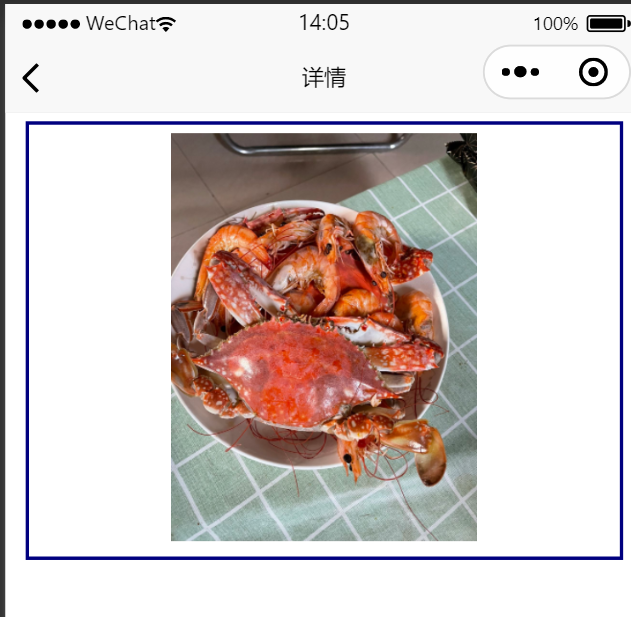

# man
写给女朋友的小程序，一个照片集

# 技术选型：uniapp+unicloud
也就是基于vue开发，同时操作云端数据库来进行curd

#云数据库表结构

# man
写给女朋友的小程序，一个照片集，场景（上传婚纱照等等）

# 技术选型：uniapp+unicloud
也就是基于vue开发，同时操作云端数据库来进行curd
数据库结构如下

通过执行云函数来操作云端数据库的存储

#小程序的效果如下
可以自定义样式，然后上传美食，美景两个板块

